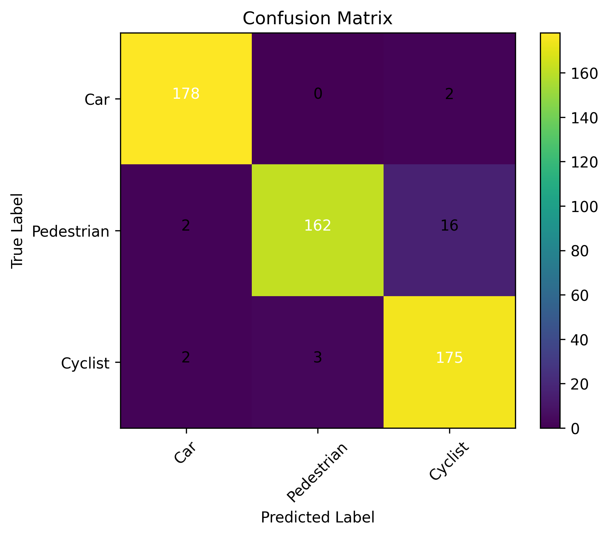

# LiDAR-Based 3D Object Classification Using a PointNet-Style Neural Network

**Author:** Mohamed Elgouhary
**Project Type:** Deep Learning / 3D Computer Vision / Pattern Recognition
**Dataset:** KITTI 3D Object Detection Dataset
**Target Classes:** Car, Pedestrian, Cyclist

This repository contains a deep-learning pipeline for **3D object classification from LiDAR point clouds** using a PointNet-style neural network.

The project uses cropped LiDAR point clouds from the KITTI object dataset and trains a neural network to classify each object into one of three categories:

* Car
* Pedestrian
* Cyclist

Each object point cloud is normalized, resampled to a fixed number of points, and passed to a PointNet-style classifier.

## Overview

LiDAR sensors are widely used in autonomous driving because they provide accurate 3D geometry of the surrounding environment. Unlike image-based methods, LiDAR point clouds represent objects as unordered sets of 3D points. This makes standard convolutional neural networks less suitable unless the data are converted into grids, voxels, or projections.

PointNet-style networks address this challenge by directly processing unordered point sets. This project implements a simple PointNet-style classification pipeline for 3D object recognition using KITTI LiDAR object crops.

## Main Goals

This project aims to:

* Prepare a balanced subset of KITTI LiDAR object crops.
* Normalize and resample each object point cloud to 1024 points.
* Train a PointNet-style neural network for 3D object classification.
* Evaluate classification performance using accuracy, confusion matrix, and class-wise metrics.
* Generate plots, logs, and a written report for reproducibility.

## Repository Structure

```text
Lidar-Pointnet-Project/
├── README.md
├── requirements.txt
├── src/
│   ├── dataset.py
│   ├── evaluate.py
│   ├── model.py
│   ├── prepare_dataset.py
│   ├── train.py
│   └── utils.py
├── outputs/
│   ├── checkpoints/
│   ├── figures/
│   └── logs/
└── report/
```

## Main Files

| File / Folder            | Description                                                      |
| ------------------------ | ---------------------------------------------------------------- |
| `src/prepare_dataset.py` | Prepares the KITTI-based metadata and object point-cloud samples |
| `src/dataset.py`         | Dataset loading and preprocessing utilities                      |
| `src/model.py`           | PointNet-style neural network architecture                       |
| `src/train.py`           | Training script                                                  |
| `src/evaluate.py`        | Evaluation script                                                |
| `src/utils.py`           | Helper functions                                                 |
| `outputs/checkpoints/`   | Saved trained model weights                                      |
| `outputs/logs/`          | Training and evaluation logs                                     |
| `outputs/figures/`       | Generated plots and visualizations                               |
| `report/`                | Project report files                                             |

## Method Summary

The complete pipeline is:

```text
KITTI LiDAR object data
        ↓
Object crop extraction / metadata preparation
        ↓
Point-cloud normalization
        ↓
Resampling to 1024 points
        ↓
PointNet-style feature extraction
        ↓
Global feature aggregation
        ↓
Fully connected classification head
        ↓
Class prediction: Car / Pedestrian / Cyclist
```

## Model Description

The model follows the general PointNet idea:

1. Each point is represented by its 3D coordinates.
2. A shared multilayer perceptron extracts point-wise features.
3. A symmetric aggregation function, such as max pooling, produces a global feature vector.
4. Fully connected layers classify the object point cloud.

This design is suitable for point clouds because it does not depend on the order of points.

## Dataset

This project is designed for the KITTI 3D object detection dataset.

The target object classes are:

```text
Car
Pedestrian
Cyclist
```

Because the KITTI dataset is large and has its own usage terms, the raw dataset is **not included** in this repository. Users should download KITTI from the official dataset source and place the files in the expected local data directory before running the preprocessing script.

## Installation

### 1. Clone the repository

```bash
git clone https://github.com/Mohamed-Elgouhary/Lidar-Pointnet-Project.git
cd Lidar-Pointnet-Project
```

### 2. Create a virtual environment

```bash
python -m venv .venv
source .venv/bin/activate
```

On Windows:

```bash
python -m venv .venv
.venv\Scripts\activate
```

### 3. Install dependencies

```bash
pip install -r requirements.txt
```

The main dependencies are:

```text
numpy
matplotlib
scikit-learn
torch
torchvision
tqdm
open3d
```

## Recommended `requirements.txt`

Use one package per line:

```text
numpy
matplotlib
scikit-learn
torch
torchvision
tqdm
open3d
```

## How to Run

### Step 1: Prepare the dataset

After downloading the KITTI dataset and setting the correct data path, run:

```bash
python src/prepare_dataset.py
```

This step prepares the metadata and point-cloud samples used for training and evaluation.

### Step 2: Train the model

```bash
python src/train.py
```

Training outputs are saved under:

```text
outputs/checkpoints/
outputs/logs/
outputs/figures/
```

### Step 3: Evaluate the trained model

```bash
python src/evaluate.py
```

The evaluation script reports classification performance and can generate figures such as:

* Confusion matrix
* Accuracy plot
* Training loss curve
* Class-wise performance metrics

## Expected Output

After training and evaluation, the repository may contain:

```text
outputs/
├── checkpoints/
│   └── best_model.pth
├── figures/
│   ├── confusion_matrix.png
│   ├── training_loss.png
│   └── accuracy_curve.png
└── logs/
    └── training_log.csv
```

The exact filenames may differ depending on the current implementation.

## Example Use Cases

This repository can be used for:

* Learning how PointNet-style models process point clouds.
* Training a simple LiDAR object classifier.
* Comparing point-cloud classification results across classes.
* Preparing a pattern-recognition or deep-learning course project.
* Building a baseline for autonomous-driving perception research.
* Extending the model to other LiDAR datasets or additional object classes.

## Suggested Experiments

Possible extensions include:

1. Add more KITTI classes.
2. Compare 512, 1024, and 2048 input points.
3. Add point-cloud augmentation such as rotation, jittering, and scaling.
4. Compare PointNet with PointNet++, DGCNN, or voxel-based methods.
5. Evaluate robustness to sparse point clouds.
6. Test the model on unseen KITTI sequences.
7. Add intensity or reflectance as an additional input feature.
8. Visualize correctly and incorrectly classified point clouds.

## Results

Add your final results here after evaluation.

Example format:

| Metric              | Value      |
| ------------------- | ---------- |
| Overall Accuracy    | Add result |
| Car Accuracy        | Add result |
| Pedestrian Accuracy | Add result |
| Cyclist Accuracy    | Add result |

You can also include the confusion matrix figure:

```markdown

```

## Reproducibility Notes

To improve reproducibility:

* Use the same train/test split.
* Fix the random seed in training.
* Use the same number of sampled points per object.
* Report the number of samples per class.
* Save the trained model checkpoint.
* Save the training configuration.
* Keep generated figures and logs under `outputs/`.

## Limitations

This project is intended as a compact educational and research baseline. Some limitations may include:

* The model uses cropped object point clouds rather than full-scene detection.
* Classification performance depends on the quality of object crops.
* The baseline PointNet-style architecture may not capture local geometric structure as strongly as PointNet++ or graph-based networks.
* The raw KITTI dataset is not included in the repository.

## Suggested GitHub Topics

Add these topics to the GitHub repository:

```text
lidar
point-cloud
pointnet
kitti
3d-object-classification
deep-learning
computer-vision
autonomous-driving
pytorch
pattern-recognition
open3d
robotics
```

## Suggested GitHub Description

Use this as the repository description:

```text
PointNet-style PyTorch pipeline for LiDAR-based 3D object classification on KITTI point clouds.
```

## Author

This repository is developed and maintained by:

**Mohamed Elgouhary**
PhD Student and Graduate Research Assistant
Lane Department of Computer Science and Electrical Engineering
West Virginia University

## Acknowledgment

This project was developed as part of work in deep learning, pattern recognition, 3D computer vision, and autonomous-driving perception.

## Contact

For questions or collaboration, please contact:

**Mohamed Elgouhary**
Email: [mae00018@mix.wvu.edu](mailto:mae00018@mix.wvu.edu)
